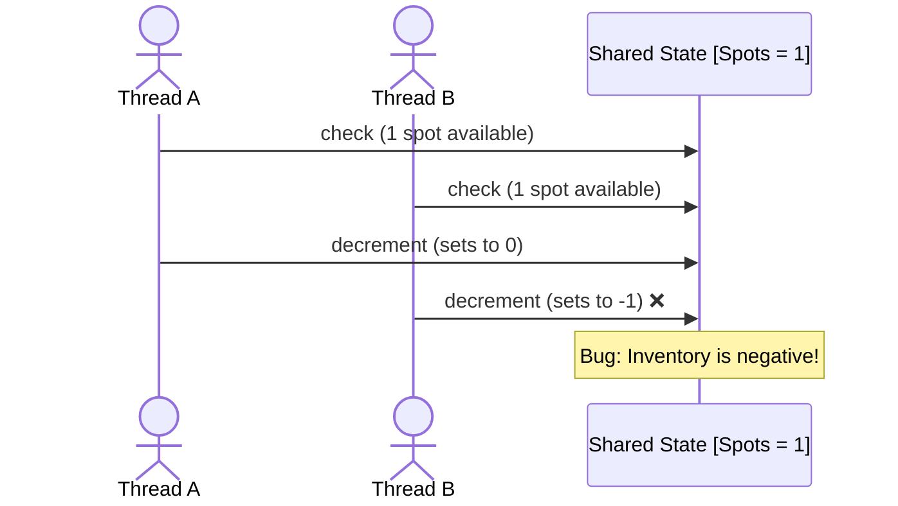
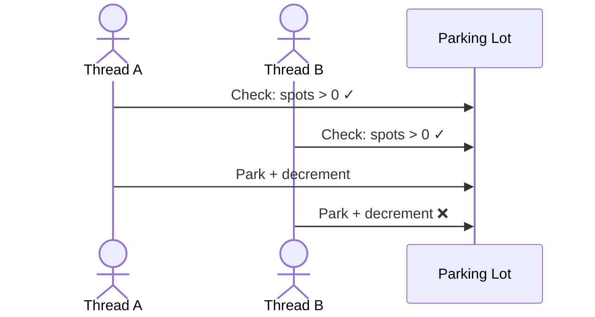
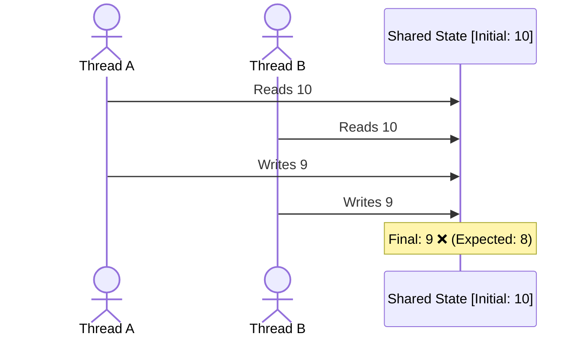

# Correctness

The goal of concurrency correctness is simple:
> No matter how threads interleave, the program must preserve its invariants.

In an LLD interview, correctness means being able to identify what can go wrong, then choose the smallest mechanism that prevents it.

## The Problem
Consider a parking lot with one available spot:
```go
if parkingLot.AvailableSpots > 0 {
    parkingLot.AvailableSpots--
    return true
}

return false
```


The problem isn't the individual operations. The problem is that:
```text
check + update must happen as one indivisible operation.
```

### Key concept: Invariant
An invariant is something that must always remain true. For the parking lot:
```text
availableSpots >= 0
```
Concurrency correctness means protecting the operations that preserve this invariant.

## Solutions
There are four common approaches:

| Technique | Idea | Typical use |
|---|---|---|
| **Coarse-grained locking** | One lock protects everything | Simple shared state |
| **Fine-grained locking** | Multiple locks protect independent state | Higher concurrency |
| **Atomic variables** | Hardware-supported atomic operations | Counters, flags |
| **Thread confinement** | Don't share mutable state | Worker-owned state |

The important interview question isn't _Which technique do I know?_ It's:
> What state is shared, what invariant does it have, and what is the smallest thing that must be synchronized?

### Coarse-Grained Locking
Use one lock around the critical section. Only one goroutine can modify the state at a time.
```go
type Floor struct {
    spots []Spot
}

type ParkingLot struct {
    mu             sync.Mutex
    floors         []Floor
    availableSpots int
}

func (p *ParkingLot) Park() bool {
    p.mu.Lock()
    defer p.mu.Unlock()

    if p.availableSpots == 0 {
        return false
    }

    p.availableSpots--
    return true
}
```

| Pros | Cons |
|---|---|
| Simple | Limits concurrency |
| Easy to reason about | Unrelated operations block each other |
| Low risk of synchronization bugs | Can become a bottleneck |

For most LLD interviews, start here. Optimize only when there is a reason.
#### Read-Write Locks
If the parking lot has many concurrent readers and relatively few writers, a sync.RWMutex can allow multiple readers:
```go
p.mu.RLock()
spots := p.availableSpots
p.mu.RUnlock()
```
But reads must still use the lock if they access shared mutable state.

### Fine-Grained Locking
Instead of one lock for the entire parking lot, give each floor its own lock.
```go
type Floor struct {
    mu    sync.Mutex
    spots []Spot
}

type ParkingLot struct {
    floors []Floor
}
```
Now two goroutines can operate on different floors concurrently.
```text
Floor 1 → Lock 1 → Park
Floor 2 → Lock 2 → Park
```
This improves concurrency, but increases complexity.
#### The catch
Multiple locks introduce the possibility of deadlock. For example:
```text
Goroutine A: Lock Floor 1 → waits for Floor 2
Goroutine B: Lock Floor 2 → waits for Floor 1
```
If multiple locks are needed, establish a consistent lock ordering.
Rule:
> Use fine-grained locking only when the additional concurrency justifies the additional complexity.

### Atomic Variables
Sometimes the shared state is just a single value.

For example, if we only needed to increment or decrement a counter, an atomic operation can avoid a mutex.
```go
atomic.AddInt64(&p.availableSpots, -1)
```
The operation itself is atomic. But this is not enough for:
```go
if p.availableSpots > 0 {
    p.availableSpots--
}
```
The problem is that this is a multi-step invariant:
```text
check → decrement
```
Making the decrement atomic does not make the whole sequence atomic.
#### Rule
> Atomics are good for independent single-variable operations. Use a lock when correctness depends on multiple operations or multiple fields.

### Thread Confinement (Shared Nothing)
Another way to avoid races is to avoid sharing mutable state. Instead of allowing many goroutines to modify the parking lot directly, give ownership to one goroutine.
```text
                 ┌──────────────┐
Request ────────►│ Parking Lot  │
Request ────────►│   Goroutine  │
Request ────────►│              │
                 └──────────────┘
                       │
                 owns all state
```
Other goroutines communicate through channels.
```go
type ParkRequest struct {
    result chan bool
}
```
The owner goroutine processes requests sequentially. No shared mutable state means no mutex is required for that state.

#### Trade-off
| Benefit | Cost |
|---|---|
| Very easy correctness reasoning | Serialization can limit throughput |
| No data races on owned state | More communication complexity |
| Clear ownership | Requires a different architecture |

This pattern is particularly natural in Go.

## Common Concurrency Bugs
Most correctness bugs in LLD interviews reduce to two patterns:
1. Check-Then-Act
2. Read-Modify-Write

Recognizing these patterns quickly is more important than memorizing synchronization APIs.

### Check-Then-Act
The code checks a condition and later acts on the assumption that the condition is still true.
```go
if p.availableSpots > 0 {  // Check
    p.availableSpots--      // Act
}
```
Another goroutine can change the state between the two operations.

#### Fix
Make the entire check-and-act operation mutually exclusive:
```go
p.mu.Lock()
defer p.mu.Unlock()

if p.availableSpots == 0 {
    return false
}

p.availableSpots--
return true
```
#### Recognition pattern
Whenever you see:
```text
    if condition {
        modify state
    }
```
ask:
> Can another goroutine change condition before the modification?
If yes, you have a potential check-then-act race.

**Fun Fact: In distributed systems, this issue causes Write Skew / Phantom reads**
### Read-Modify-Write
A read followed by a modification and write is often not atomic. For example:
```go
p.availableSpots = p.availableSpots - 1
```
Looks like one line, but conceptually it is:
1. Read current value
2. Calculate new value
3. Write new value


This is a lost update.

#### Fix
Use a mutex:
```go
p.mu.Lock()
p.availableSpots--
p.mu.Unlock()
```
Or, when the operation is truly independent:
```go
atomic.AddInt64(&p.availableSpots, -1)
```
The choice depends on whether the operation involves a larger invariant.

## Exercises
### Exercise 1: Coarse-Grained Locking
Run this program. The final count is expected to be 100000, but it won't reliably be.

Task: Fix it using one mutex.

<details class="lld-reveal">
<summary><span class="lld-reveal-icon" aria-hidden="true"></span>Template code</summary>

```go
package main

import (
	"fmt"
	"sync"
)

func main() {
	counter := 0

	var wg sync.WaitGroup

	for i := 0; i < 100; i++ {
		wg.Add(1)

		go func() {
			defer wg.Done()

			for j := 0; j < 1000; j++ {
				counter++
			}
		}()
	}

	wg.Wait()

	fmt.Println("Expected:", 100000)
	fmt.Println("Actual:", counter)
}
```

</details>

### Exercise 2: Fine-Grained Locking
There are two independent counters. Operations on one counter should not block operations on the other.

Task: Fix the program using fine-grained locking.

<details class="lld-reveal">
<summary><span class="lld-reveal-icon" aria-hidden="true"></span>Template code</summary>

```go
package main

import (
	"fmt"
	"sync"
)

type Counter struct {
	value int
}

func main() {
	counters := [2]Counter{}

	var wg sync.WaitGroup

	for i := 0; i < 100; i++ {
		wg.Add(2)

		go func() {
			defer wg.Done()

			for j := 0; j < 1000; j++ {
				counters[0].value++
			}
		}()

		go func() {
			defer wg.Done()

			for j := 0; j < 1000; j++ {
				counters[1].value++
			}
		}()
	}

	wg.Wait()

	fmt.Println("Counter 0:", counters[0].value)
	fmt.Println("Counter 1:", counters[1].value)
}
```

</details>

### Exercise 3: Atomic Variables
The program has a single shared counter.

Task: Fix it without using a mutex. Use an atomic operation.

<details class="lld-reveal">
<summary><span class="lld-reveal-icon" aria-hidden="true"></span>Template code</summary>

```go
package main

import (
	"fmt"
	"sync"
)

func main() {
	var counter int64

	var wg sync.WaitGroup

	for i := 0; i < 100; i++ {
		wg.Add(1)

		go func() {
			defer wg.Done()

			for j := 0; j < 1000; j++ {
				counter++
			}
		}()
	}

	wg.Wait()

	fmt.Println("Expected:", 100000)
	fmt.Println("Actual:", counter)
}
```

</details>

### Exercise 4: Thread Confinement
Each worker needs to process 10,000 items.

Task: Avoid shared mutable state between workers. Each worker should own its counter and send its result to the main goroutine.

<details class="lld-reveal">
<summary><span class="lld-reveal-icon" aria-hidden="true"></span>Template code</summary>

```go
package main

import (
	"fmt"
	"sync"
)

func main() {
	total := 0

	var wg sync.WaitGroup

	for i := 0; i < 10; i++ {
		wg.Add(1)

		go func() {
			defer wg.Done()

			for j := 0; j < 10000; j++ {
				total++
			}
		}()
	}

	wg.Wait()

	fmt.Println("Expected:", 100000)
	fmt.Println("Actual:", total)
}
```

</details>