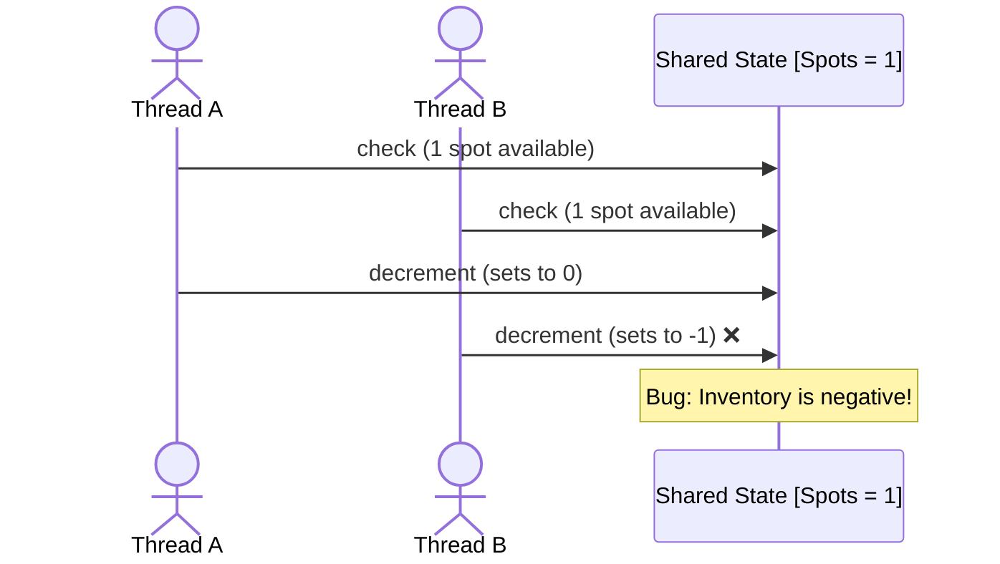

# Correctness

The goal of concurrency correctness is simple:
> No matter how threads interleave, the program must preserve its invariants.

In an LLD interview, correctness means being able to identify what can go wrong, then choose the smallest mechanism that prevents it.

## The Problem
Consider a parking lot with one available spot:
```go
if parkingLot.AvailableSpots > 0 {
    parkingLot.AvailableSpots--
    return true
}

return false
```


The problem isn't the individual operations. The problem is that:
```text
check + update must happen as one indivisible operation.
```

### Key concept: Invariant
An invariant is something that must always remain true. For the parking lot:
```text
availableSpots >= 0
```
Concurrency correctness means protecting the operations that preserve this invariant.