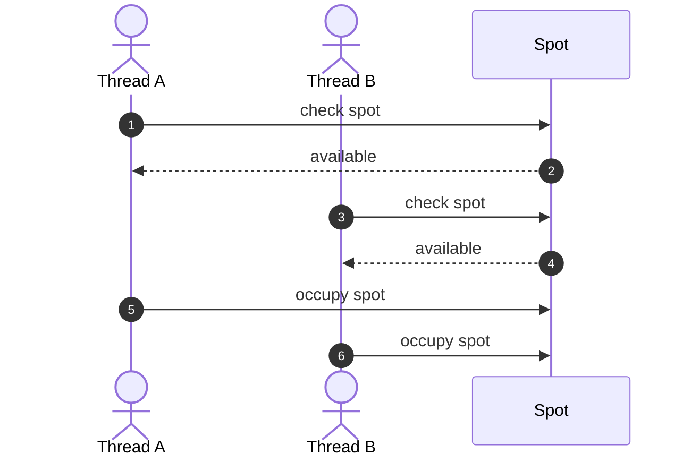
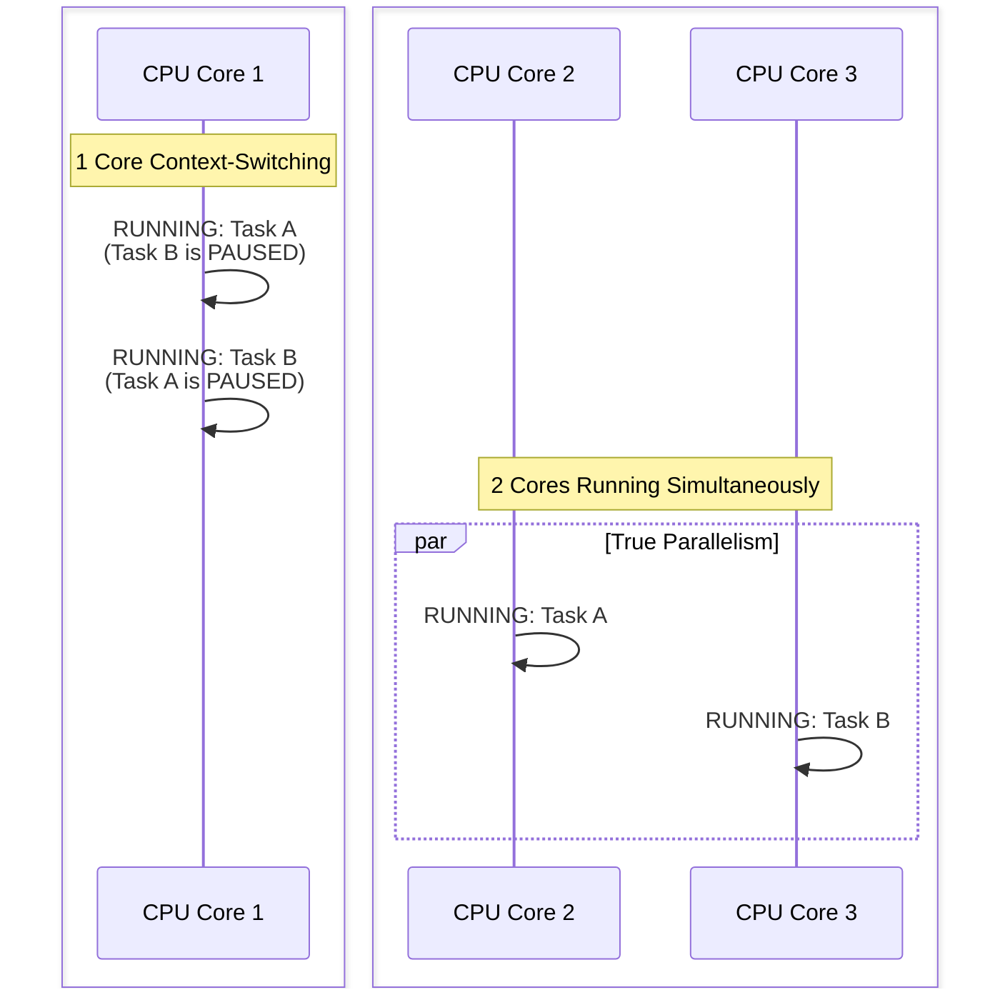
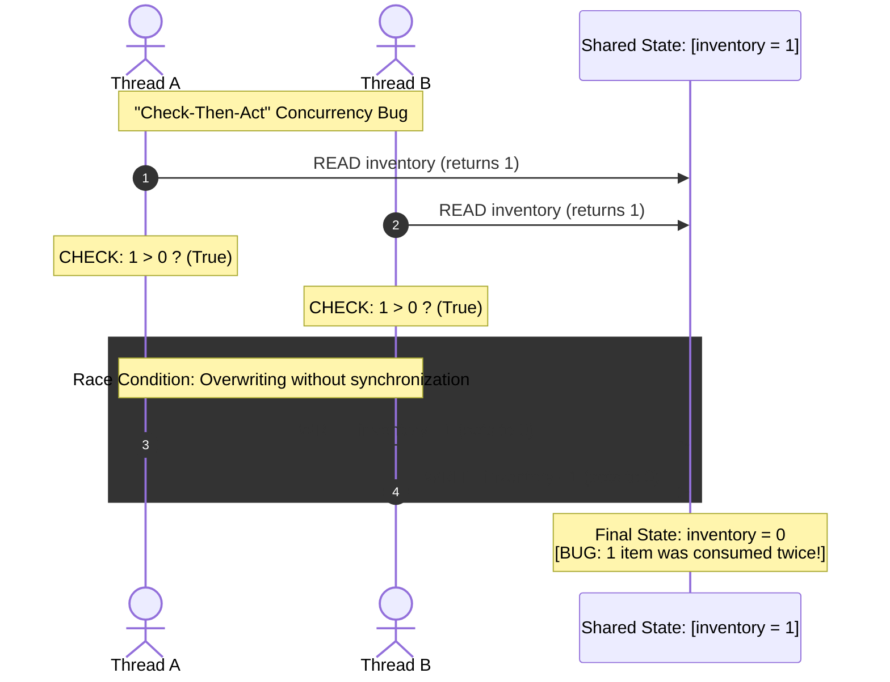

# Introduction

Concurrency means multiple threads executing against the same in-memory state at overlapping times. The core problem is that the order of execution is unpredictable.

## Why do we care?
Consider a parking lot with one empty spot:

Both threads saw the same state. The resulting system state is invalid: two cars believe they own one spot. The important interview question is therefore:
> What happens if two operations execute concurrently?

That's the lens you should apply to almost every LLD problem.

## Concurrency vs Parallelism
These are related but different.
Concurrency = multiple tasks can make progress independently and their operations can interleave.
Parallelism = multiple tasks are literally executing at the same time, typically on different CPU cores.

For LLD interviews, concurrency is the important concept. The operations can interleave unpredictably. On multiple cores, they can actually execute simultaneously. Either way, the problem is the same:
> Multiple execution paths are accessing shared state.



## The real source of concurrency bugs
Most concurrency bugs come from shared mutable state.

One item was consumed twice. This pattern is called check-then-act and will show up constantly in LLD interviews.

## What concurrency adds to an LLD problem
Normally you might design:
```text
ParkingLot
    └── ParkingSpot

park(car)
unpark(car)
```

Then the interviewer asks:
> What if two cars try to take the same spot simultaneously?

Now you need to answer:
1. What state is shared?
2. What operations can overlap?
3. What invariant must never be violated?
4. How do we protect that invariant?

For example:
```text
Invariant: A parking spot can belong to at most one car.
```
Then:
```text
find available spot + claim spot  --> must effectively behave as one atomic operation.
```
That's the essence of concurrency in LLD.

## The 3 concurrency problems you should recognize
Most LLD concurrency questions fall into three buckets:

| Problem | Core question | Typical solution |
| :--- | :--- | :--- |
| **Correctness** | Can concurrent operations corrupt state? | Locks, atomics |
| **Coordination** | How do threads communicate/wait? | Queues, conditions, channels |
| **Scarcity** | How do we limit access to a finite resource? | Semaphores, pools |


#### Correctness
```text
Two threads → same seat
```
Need to protect shared state.

#### Coordination
```text
Producer → Queue → Consumer
```
Consumer may need to wait until work exists.

#### Scarcity
```text
100 requests
     ↓
10 DB connections
```
Only 10 operations can use the resource concurrently. These categories are more useful in interviews than memorizing individual concurrency APIs.

## The mental model for interviews
When the interviewer introduces concurrency, don't immediately say:
> I'll use a mutex.

First ask:
#### Step 1: What is shared?
- inventory
- parking spots
- account balance
- queue
- connection pool

#### Step 2: What can happen concurrently?
- reserve()
- cancel()
- update()
- read()

#### Step 3: What must remain true?
These are your invariants. Example:
- inventory >= 0
- one seat → at most one reservation

#### Step 4: What synchronization is required?
Only now choose:
- atomic
- mutex
- RW lock
- semaphore
- condition variable
- blocking queue

### The key takeaway
For LLD, don't think:
> Concurrency = locks.

Think:
> Concurrency = unpredictable interleaving of operations on shared state.

Your job is to identify the shared state + invariant, then choose the simplest mechanism that preserves that invariant.

That's the foundation. The next topic should be Correctness, where we go deep into race conditions, atomicity, check-then-act, locks, atomics, and how to reason about whether a piece of code is actually thread-safe.