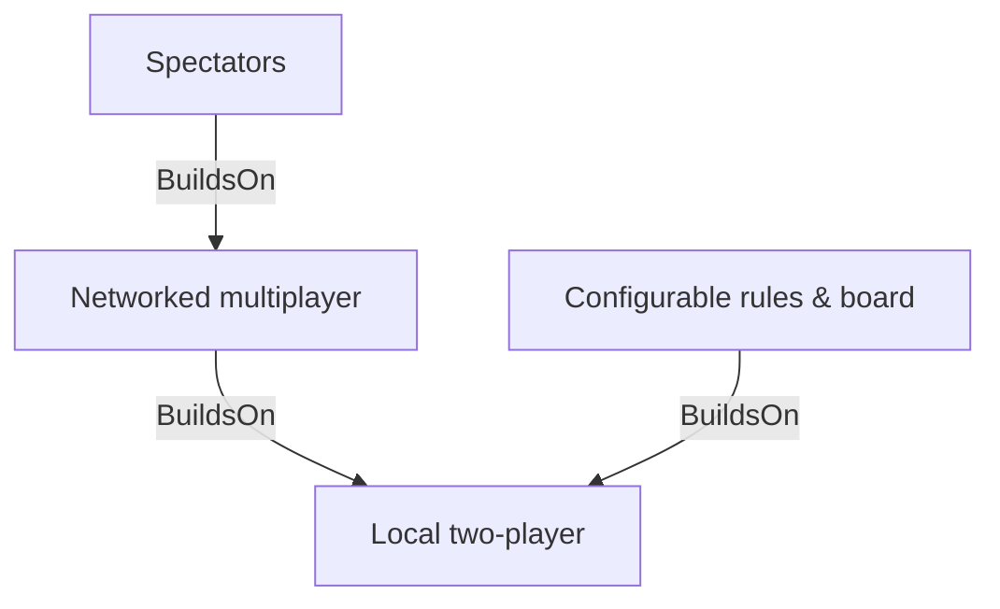

# Connect Four

Extensions are **siblings** in the sidebar (baseline first). Dependencies:

```mermaid
flowchart TD
  baseline["Local two-player"]
  networked["Networked multiplayer"]
  configurable_rules["Configurable rules & board"]
  spectators["Spectators"]
  networked -->|BuildsOn| baseline
  configurable_rules -->|BuildsOn| baseline
  spectators -->|BuildsOn| networked
```
