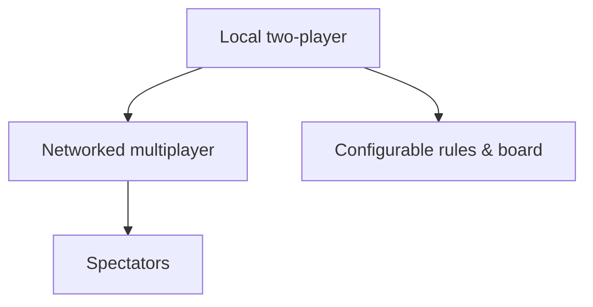

# Connect Four

Extensions are **siblings** in the sidebar (baseline first). Use **Builds on** or the graph to see dependencies.

| Extension | Builds on |
| --- | --- |
| [Local two-player](/problems/connect-four/extensions/baseline/requirements) | — |
| [Networked multiplayer](/problems/connect-four/extensions/networked/requirements) | [Local two-player](/problems/connect-four/extensions/baseline/requirements) |
| [Configurable rules & board](/problems/connect-four/extensions/configurable-rules/requirements) | [Local two-player](/problems/connect-four/extensions/baseline/requirements) |
| [Spectators](/problems/connect-four/extensions/spectators/requirements) | [Networked multiplayer](/problems/connect-four/extensions/networked/requirements) |
