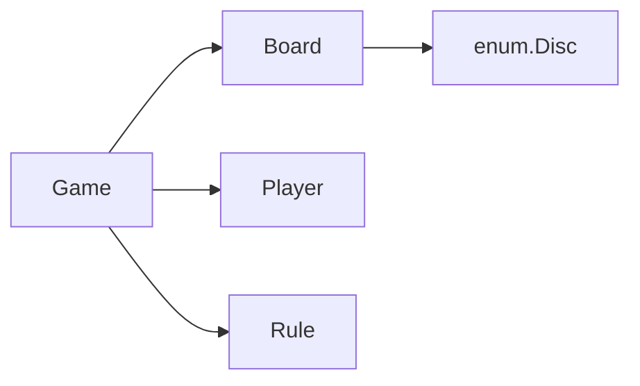

# Entities and relationships

## Responsibilities

| Entity | Owns |
| --- | --- |
| **Game** | Players, board, state machine, turn order, orchestrates `MakeMove` |
| **Board** | Grid, column validity, gravity placement, line counting for win checks |
| **Player** | Display name and disc color |
| **Rule** | Whether the last move created a win (strategy object) |



## Game state machine

```text
NOT_PLAYING → (StartGame) → PLAYING → WON | DRAW
```

- Players register only in `NOT_PLAYING`.  
- `MakeMove` allowed only in `PLAYING`.  
- After a winning placement, state becomes `WON` and further moves error.

## Public API (sketch)

**Player** — name and disc accessor.

**Board** — `PlaceDisk`, fullness check, directional count from a cell.

**Game** — `AddPlayer`, `StartGame`, `MakeMove`, accessors for current player, winner, state.

**Rule** — `Satisfied(board, row, col)` so future variations can swap win logic without changing `Game`’s turn flow.

## Design choices

1. **Win rule as interface** — `FourRule` implements four-in-a-row; board stays generic.  
2. **Errors over silent failure** — invalid moves return errors to the CLI loop.  
3. **Board dimensions in constructor** — keeps the door open for board-size follow-ups without changing call sites in tests.

Next: [Codebase](/problems/connect-four/variation-1/codebase).
