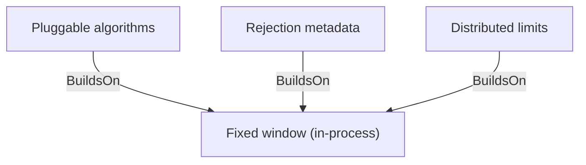

# Rate limiter

Extensions are **siblings** in the sidebar (baseline first). Dependencies:

```mermaid
flowchart TD
  baseline["Fixed window (in-process)"]
  pluggable_algorithms["Pluggable algorithms"]
  rejection_metadata["Rejection metadata"]
  distributed["Distributed limits"]
  pluggable_algorithms -->|BuildsOn| baseline
  rejection_metadata -->|BuildsOn| baseline
  distributed -->|BuildsOn| baseline
```
