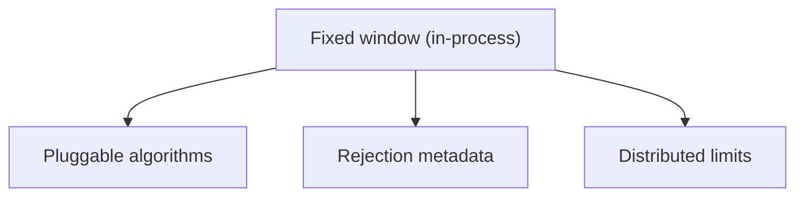

# Rate limiter

Extensions are **siblings** in the sidebar (baseline first). Use **Builds on** or the graph to see dependencies.

| Extension | Builds on |
| --- | --- |
| [Fixed window (in-process)](/problems/rate-limiter/extensions/baseline/requirements) | — |
| [Pluggable algorithms](/problems/rate-limiter/extensions/pluggable-algorithms/requirements) | [Fixed window (in-process)](/problems/rate-limiter/extensions/baseline/requirements) |
| [Rejection metadata](/problems/rate-limiter/extensions/rejection-metadata/requirements) | [Fixed window (in-process)](/problems/rate-limiter/extensions/baseline/requirements) |
| [Distributed limits](/problems/rate-limiter/extensions/distributed/requirements) | [Fixed window (in-process)](/problems/rate-limiter/extensions/baseline/requirements) |
