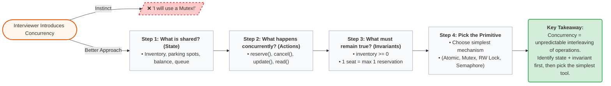

# The mental model for interviews

### The key takeaway
For LLD, don't think:
> Concurrency = locks.

Think:
> Concurrency = unpredictable interleaving of operations on shared state.

Your job is to identify the shared state + invariant, then choose the simplest mechanism that preserves that invariant.
