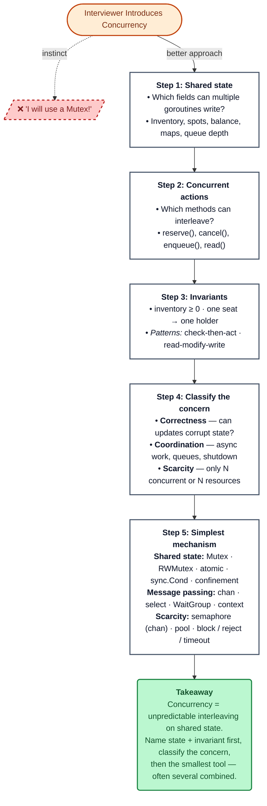

# The mental model for interviews

### Coordination follow-ups (don’t stop at “I’ll use a channel”)

When the prompt is async APIs, worker pools, or background processing, say out loud:

1. What happens when the **queue is full** — block, reject (`select` + `default`), or scale?
2. How does **graceful shutdown** work — stop accepting, drain, wait for workers?
3. Can work be **lost** — in-memory channel vs durable queue?
4. Does **ordering** or **retry on failure** matter?

### The key takeaway

For LLD, don't think:

> Concurrency = locks.

Think:

> Concurrency = unpredictable interleaving of operations on shared state.

Your job is to identify **shared state and invariants**, classify whether the hard part is **correctness**, **coordination**, or **scarcity** (often more than one), then choose the **simplest** mechanism that preserves the invariant — mutex when you must; channels when you are moving work; semaphores and pools when capacity is the limit.
